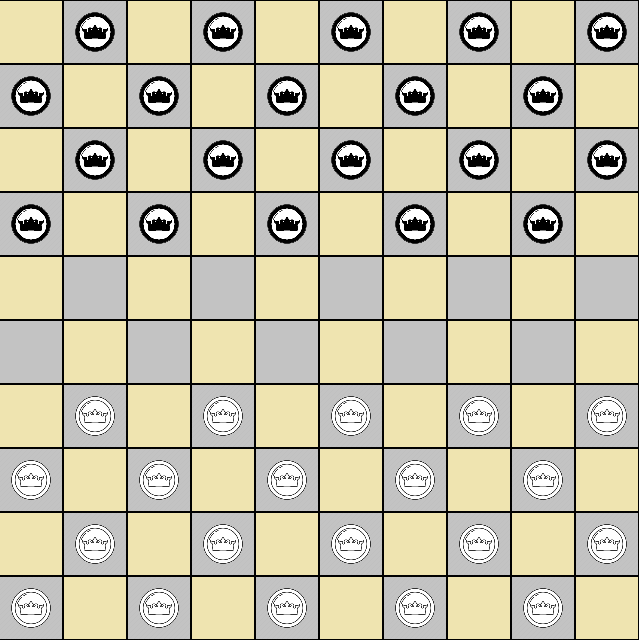
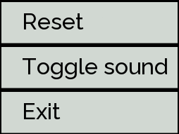
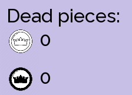
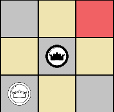
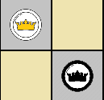

# Checkers 
Project is a full implementation of a well-known game of checkers.   

If you don't know the rules then I encourage you to read this short article: https://www.ultraboardgames.com/checkers/game-rules.php  

***
## How to compile
Versions:  
SFML 2.5.1  
MinGW 7.3.0  

1. Make sure that you have installed sfml properly and all sfml lib files are in your compiler binaries.  
Instruction on how to set up everyhing: https://www.sfml-dev.org/tutorials/2.5/start-linux.php
2. If you are using vscode you can build project by `ctrl + shift + B` using tasks.json file provided with project.  
In other cases you can compile manually by typing compile string: 
'g++ main.cpp classes/*.cpp -o main.exe -lsfml-graphics -lsfml-window -lsfml-system -lsfml-audio'

***
## Project structure
In main directory there is `main.cpp` file which is just a starter point to launch the game.  

Project is fivided into two main subdirectiories:
* classes - folder consists of all classes and their header files
* source - place for all necessary images, fonts etc.

Also in main directory there are *.dll files which are necessary to launch .exe file after build.
***
## Class overview
### GameUiController
Controller class which is responsible for handling all the game logic that is caused by UI interface and player actions. Class works closely with GameplayController as its backend logic and GraphicsRenderer as a wrapper around displaying in sfml window.

### GameplayController
Controller class which works as background almost API to which the UiController can call. Class handles all the game logic like calculating moves, checking whether move is legal, etc.

### GraphicsRenderer
Renderer class which is used to organize working with displaying sfml UI. Class contains functions and structures to which you can pass UI objects which you want to put on the screen.  

### abstract_piece.cpp
Abstract class that has all necesarry functionalities for game Pieces.  

### pieces.cpp
File contains two classes which derive from AbstractPiece and they implement their own class unique things.
***
## Game functionalities
### Board
Game board  

### Buttons
Reset - reset game to default state  
Toggle sound - on/off sound  
Exit - close the game    

### Counter 
Displays how many pieces each player has eliminated  

### Mandatory move highlight   
Highlight of a tile to which the player has to move (game does not allow to move anywhere else).  
After move highlight disappears.   

### Queen (in some versions called King)
Special piece obtained when enemy piece reaches end of the board. Queen can jump any number of tiles, and attack from distance. Queen can't jump over own pieces or over two enemy pieces at once.  

***
